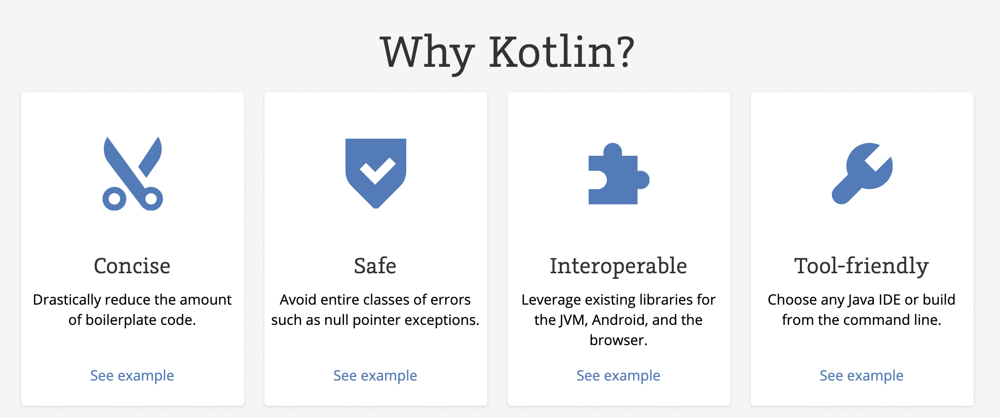

---

layout: default
title: 왜 코틀린인가?
date: 2019-07-15 21:05:00

---

# 왜 코틀린을 써야 하는가? 

먼저, 왜 코틀린을 왜 써야하는지 개인적인 생각을 적기 이전에 코틀린 공식 사이트에서 이야기 하는 코틀린을 왜 써야 하는가?에 대해서 알아보자. 



[kotlin 공식 사이트에서는](https://kotlinlang.org/) 간결함, 안정성, 그리고 JVM, Android 와 같은 기존의 존재하는 플랫폼 위에서 호환성을 이야기한다. 
그럼 하나씩 짚어보자. 

## 간결함(Concise)

코틀린은 [boilerplate]([https://ko.wikipedia.org/wiki/%EC%83%81%EC%9A%A9%EA%B5%AC_%EC%BD%94%EB%93%9C](https://ko.wikipedia.org/wiki/상용구_코드)) 코드를 상당히 줄여준다. 코드를 작성하다 보면 보일러플레이트 코드가 생기기 마련이다. 이것이 나쁘다는 것이 아니라 변하지 않는 항상 같은 패턴의 코드는 직접 작성을 하지 않고 도구의 도움을 받자는 것이다. 
예를 살펴보자. 

### data class

- Pure java

  ```java
  public class DataExample {
    private final String name;
    private int age;
    private double score;
    private String[] tags;
    
    public DataExample(String name) {
      this.name = name;
    }
    
    public String getName() {
      return this.name;
    }
    
    void setAge(int age) {
      this.age = age;
    }
    
    //... 
    public String[] getTags() {
      return this.tags;
    }
    
    public void setTags(String[] tags) {
      this.tags = tags;
    }
    
    @Override public String toString() {
      return "DataExample(" + this.getName() + ", " 
        + this.getAge() + ", " + this.getScore() + ", " 
        + Arrays.deepToString(this.getTags()) + ")";
    }
    
    protected boolean canEqual(Object other) {
      return other instanceof DataExample;
    }
    
    @Override public boolean equals(Object o) {
      //...
      return true;
    }
    
    @Override public int hashCode() {
     //...
    }
  ```

  위와 같이 java 에서 data 를 표현하는 클래스는 보일러 플레이트 코드가 상당부분 존재한다. 
  필요한 부분이지만 귀찮은 건 사실이다. 이런 귀찮음을 느낀 훌륭한 개발자들이 좋은 도구를 개발했다. 

- With [lombok](https://objectcomputing.com/resources/publications/sett/january-2010-reducing-boilerplate-code-with-project-lombok)

  ```java
  @Data public class DataExample {
    private final String name;
    @Setter(AccessLevel.PACKAGE) private int age;
    private double score;
    private String[] tags;
  ```

  바로 lombok 이다. 위 코드는 pure java 코드와 동일하다. 
  이제 코틀린을 볼 차례이다. 

- kotlin

  ```kotlin
  data class DataExample(
    val name: String, var score: String?, var tags: Array<String>?
)
	```
  
위에서 보았던 java 코드와 동일한 효과를 낸다. 
  정말 간결한지 않은가?
  
  data class 는 DTO, VO 등의 패턴을 쉽게 사용가능하도록 제공해주는 언어적 요소이다.
    equals / hashCode, toString 등을 자동으로 생성해준다.
  
  > 잘가 lombok~

### singleton

- java

- ```java
  public class Something {
      private Something() {}
  
      private static class LazyHolder {
          static final Something INSTANCE = new Something();
      }
  
      public static Something getInstance() {
          return LazyHolder.INSTANCE;
      }
  }
  ```

  Java 에서 Singleton Pattern 을 검색해보라. 얼마나 많은 지식과 많은 구현체를 볼 수 있는가? 

  > [자바 싱글턴 패턴](https://www.journaldev.com/1377/java-singleton-design-pattern-best-practices-examples)

- kotlin

  ```kotlin
  object DataProviderManager {
      fun registerDataProvider(provider: DataProvider) {
          // ...
      }
  
      val allDataProviders: Collection<DataProvider>
          get() = // ...
  }
  ```

  object 키워드 하나면 끝이다. 

  간결해 보이는가? 위에서 말한 것 이외에도 람다의 간결한 표현, 늦은 초기화 등 충분히 간결한 문법이 많이 존재한다. 

## 안전성(Safe)